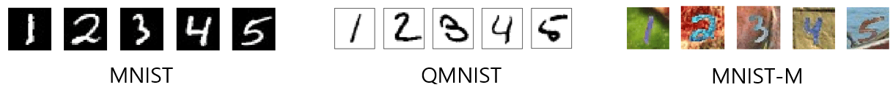
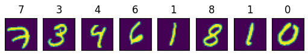
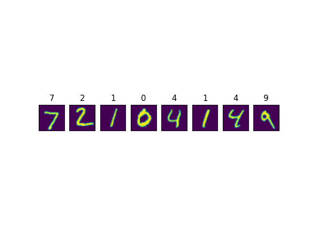
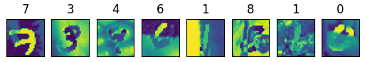
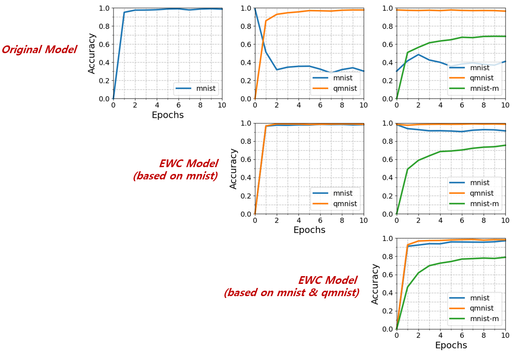

# EWC

A Tensorflow implementation of **Elastic Weight Consolidation** (EWC, in short), introduced in paper titled [**"Overcoming catastrophic forgetting in neural networks"**](https://arxiv.org/pdf/1612.00796.pdf). 

---
## What is EWC?

EWC is an algorithm designed to safeguard against **catastrophic forgetting** in neural networks. Neural Networks also have their capacity for memorizing a large amount of information. In other words, they also possibly suffer from ‘forgetting problem’. Deep learning systems have become more capable over-time, however, traditional training approaches cannot handle incrementally learning new tasks or categories without forgetting previously learned training data. In simple terms, when you have trained a model on Task A and using the same weights for learning a new Task B, then your model forgets learned information about Task A. We call this problem catastrophic forgetting.

<p align="center"></p></br>

Suppose we have two tasks, A and B, that we would like a neural network to sequentially learn. In the below picture, 𝜃*<sub>A</sub> refers to the configuration of 𝜃 that performs well at task A. But there are a number of configurations in close proximity that will also perform quite well on A; The grey ellipsoid represents the set of these configurations. The optimal solution for B would have a similar error space, represented above by the cream ellipsoid. If the network was subsequently set to learn task B without any interest in remembering task A, the network would shift its parameters in the direction of the blue arrow. However, we want to remember task A. If we naively try to make all parameters somewhat rigid, we follow the green arrow and we perform poorly on both tasks A and B. The superior approach is to make parameters more rigid or less rigid depending on their importance. By doing so, the network shifts its parameters in the direction of the red arrow, and in doing so, finds a configuration that performs well at both tasks A and B. We call this algorithm Elastic Weight Consolidation.

<p align="center"></p></br>

---
## Preparation

### Installing prerequisites

To install the prerequisite, simply type in the shell prompt the following:

```
$ pip install -r requirements.txt
```

You can use TensorFlow libraries with GPU support (See the guide at [TensorFlow tutorials](https://www.tensorflow.org/guide/gpu?hl=en)) to accelerate your code with CUDA back-end.

### Dataset

We prepared 3 different collection of handwritten digits:



* [MNIST](http://yann.lecun.com/exdb/mnist/) : A well-known monochrome digit image set to be utilized to build the initial digit classifier. 
* [QMNIST](https://github.com/facebookresearch/qmnist) : An expanded version of MNIST-like image set generated by Facebook AI Research and researchers from New York University. 
* [MNIST-M](http://yaroslav.ganin.net/) : MNIST-M is created by combining MNIST digits with the patches randomly extracted from color photos of BSDS500 as their background. 

### Note

Since the size of the MNIST-M dataset is too large to upload here, you want to click this [link](https://github.com/pumpikano/tf-dann) and follow the instruction (*Build MNIST-M dataset*) to generate the MNIST-M dataset. Once you obtain `mnistm_data.pkl`, move it to the directory named `dataset`. 

---
## Files

* `data.py`: Data provider (MNIST, QMNIST, MNIST-M). 
* `model.py`: Implementations of a categorical classifier (general vs EWC).
* `utils.py`: A bunch of utility functions for evaluation.

---
## Usage

* Load the MNIST dataset (1st task). Then build a classifier and feed the first dataset to it.



```
>>> import data, model
>>> mnist = data.MNISTdata().getTask()
>>> M.train(tasks=[mnist])
```

</br>

* Create a new model and copy weights of the original model. Compute fisher information matrix and stars (𝜃*).

```
>>> M_ewc1 = model.Model()
>>> M_ewc1.transfer_model(model=M, prev_tasks=[mnist])
```

* Train 2nd dataset **QMNIST** and repeat the model transfer (M_ewc1 -> M_ewc2).



```
>>> qmnist = data.QMNISTdata().getTask()
>>> M.train(tasks=[mnist, qmnist])
>>> M_ewc1.train(tasks=[mnist, qmnist])

>>> M_ewc2 = model.Model()
>>> M_ewc2.transfer_model(model=M_ewc1, prev_tasks=[mnist, qmnist])
```

* Train 3rd dataset **MNIST-M**.



```
>>> mnistm = data.MNIST_Mdata().getTask()
>>>M.train(tasks=[mnist, qmnist, mnistm])
>>>M_ewc1.train(tasks=[mnist, qmnist, mnistm])
>>>M_ewc2.train(tasks=[mnist, qmnist, mnistm])
```

* Check how well those EWC models maintain high performance on previous tasks while retaining the ability to learn current tasks.

```
>>> import utils
>>> utils.visualize_multi_acc([M, M_ewc1, M_ewc2])
```


